<p align="center">
  
</p>

<h1 align="center">Creating Your First MCP Server</h1>

<p align="center"><b>Extend Claude with your own tools.</b> A clean, production-ready TypeScript MCP server with example tools — the template for exposing your own functions, data and prompts to any MCP client.</p>

<p align="center">
  
  
  
  <a href="LICENSE"></a>
</p>

---

## What is MCP?

The **Model Context Protocol** is an open standard for how apps give LLMs context. An **MCP server** exposes capabilities; an **MCP client** (like Claude) discovers and uses them. Write a server once, and any MCP client can plug into it.

## The building blocks

<p align="center">
  
</p>

| | What |
|---|---|
| **Tools** | executable functions the model can call — this repo ships `calculator`, `file-ops` and `weather` |
| **Resources** | structured data exposed by URI (files, records, APIs) |
| **Prompts** | reusable, parameterized prompt templates |

## Quick start

```bash
git clone https://github.com/ry-ops/creating-your-first-mcp-server.git
cd creating-your-first-mcp-server
npm install
npm run build
npm start            # run the server (stdio)
npm run example      # run the example client against it
```

Then point an MCP client at it. For Claude Desktop, add to `claude_desktop_config.json`:

```json
{
  "mcpServers": {
    "first-server": {
      "command": "node",
      "args": ["/absolute/path/to/creating-your-first-mcp-server/dist/index.js"]
    }
  }
}
```

## Build your own tool

Add a file under [`src/tools/`](src/tools/) alongside `calculator.ts`, `file-ops.ts` and `weather.ts`, register it in [`src/index.ts`](src/index.ts), and rebuild. The [`examples/client.ts`](examples/client.ts) shows how to list and call tools.

## Learn the concepts

- [MCP-CONCEPTS.md](documentation/MCP-CONCEPTS.md) — servers, clients, tools, resources, prompts
- [TOOL-DEVELOPMENT.md](documentation/TOOL-DEVELOPMENT.md) — writing a tool
- [INTEGRATION.md](documentation/INTEGRATION.md) — connecting clients

> Building on the SDK directly? The [Claude API docs](https://docs.claude.com) cover MCP and the tool-use loop.

## License

MIT. See [LICENSE](LICENSE).

<!-- org-footer -->
---

<p align="center"><sub>Part of <a href="https://github.com/ry-ops">ry-ops</a> · building the pipes between infrastructure, automation, and observability · built by <a href="https://github.com/ry-ops">ry-ops</a></sub></p>
